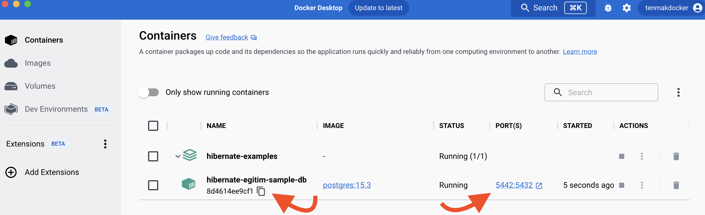

# Ortam Kurulumu

Idea üzerinden Get From VCS ile repository klonlanır:


Repository klonlandıktan sonra terminalden (docker-compose.yml dosyasının olduğu dizinde) Örnek veritabanı aşağıdaki komut ile oluşturulur:

```sh
docker-compose up -d
```

Docker desktop üzerinden örnek veritabanının oluşturulduğu kontrol edilir.



Bağlantı bilgileri:

```bash
kullanıcı: postgres
parola: postgres
port: 5442
```